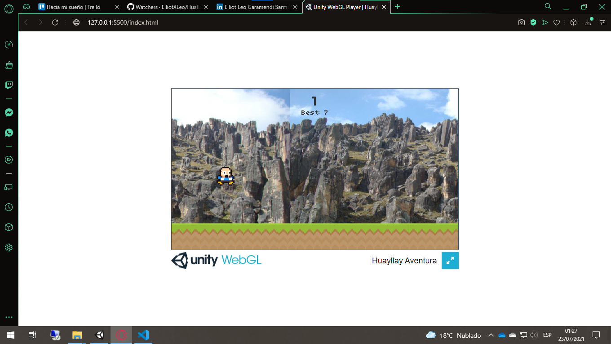
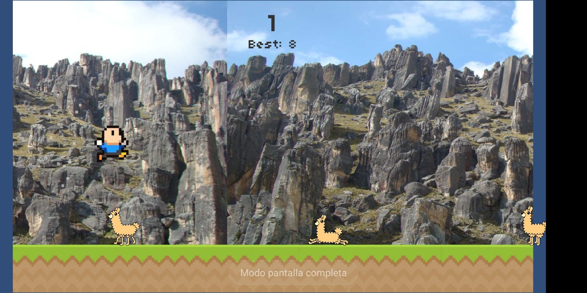
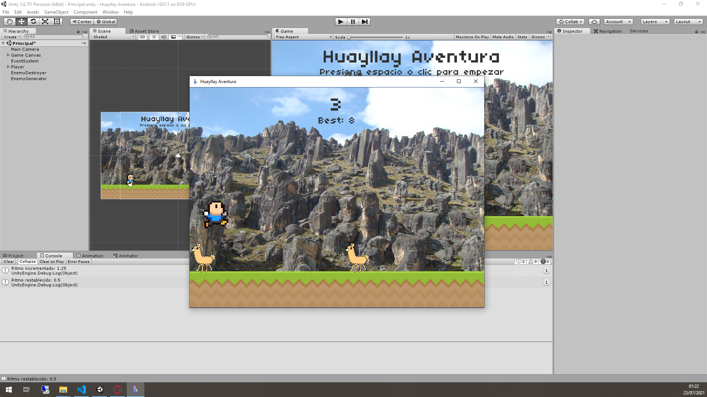

# [Huayllay Aventura]() |  |  |  

## Plataformas
### Web

### Móvil

### Escritorio

Videojuego Huayllay Aventura desarrollado en Unity 5 donde se aplican los conceptos de:
- Realización de diseños multiplataforma funcionales en cualquier dispositivo.
- La utilización de objetos de UI para crear el escenario de tus juegos y efectos parallax.
- Manejo de animaciones, colisiones y partículas desde scripts.
- Manejo de objetos de forma dinámica (crearlos, posicionarlos y destruirlos).
- Comunicación de objetos y acceso a sus métodos con SendMessage.

## Instalación
- Ubicarse en la carpeta que contendrá el proyecto
- Abrir terminal de comandos
  - git clone https://github.com/ElliotXLeo/Huallay-Aventura

Se tiene la carpeta de Despliegue que contiene compilados para ejecutar. .Exe para abrir en el escritorio, Apk, para instalar en un celular con android e index.html para abrirlo en un servidor web. Si se requiere personalizar el proyecto ir a la carpeta proyecto, abrir con Unity 5 y a disfrutar.

## Tecnologías usadas
| C# | Unity 5 |
| --- | --- |
|  |  |

## Versiones
| Web | Movil | Escritorio |
| --- | --- | --- |
|  |  |  |

## Redes sociales

- GitHub: https://github.com/ElliotXLeo

- LinkedIn: www.linkedin.com/in/elliotgaramendi

- Facebook: https://web.facebook.com/elliotgaramendi